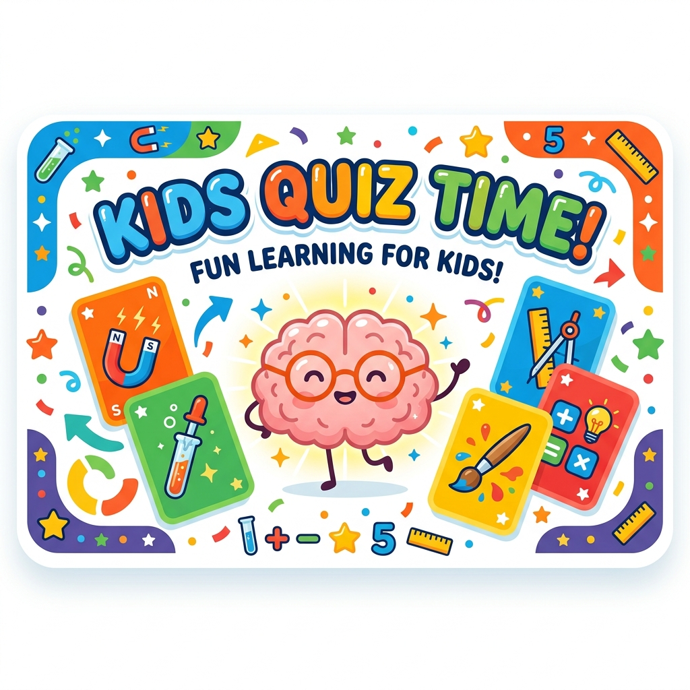
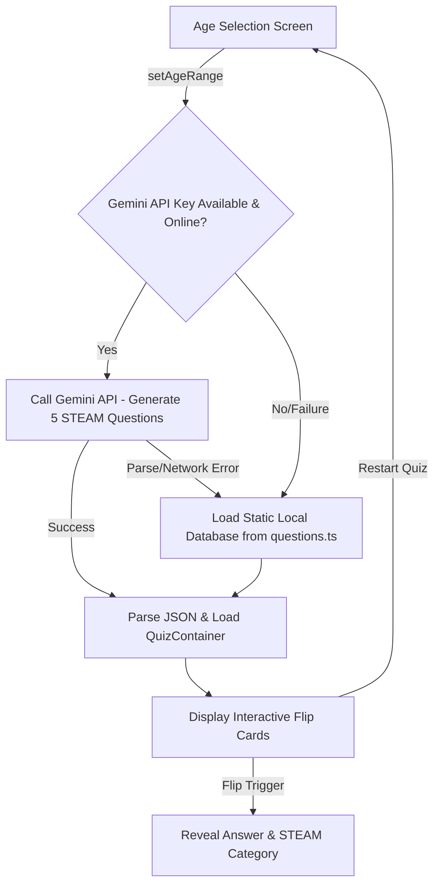

<p align="center">
  
</p>

# Kids Quiz Time! 🧠✨

> A vibrant, AI-powered STEAM (Science, Technology, Engineering, Arts, Mathematics) quiz game designed for kids aged 4–12. Interactive, encouraging, and highly resilient!

---

<p align="center">
  
  
  
  
  
  
</p>

---

## 🌟 Overview

**Kids Quiz Time** is an interactive, educational flip-card web application designed to introduce children to the exciting world of STEAM. Rather than relying on static, repetitive questionnaires, the app leverages **Google's Gemini AI** to dynamically generate fresh, developmentally tailored quizzes on the fly. 

To ensure kids can play anytime, anywhere (such as in classrooms or during car rides), the application features a **fail-safe local database** that instantly and transparently takes over if the API keys are missing or internet connectivity is lost.

---

## 🚀 Key Features

*   🎯 **Age-Appropriate Tiers**:
    *   **Ages 4 to 6**: Visual recognition and basic vocabulary matching. Larger emojis and simple, easy-to-read phrasing.
    *   **Ages 7 to 9**: Intermediate concepts focusing on facts, curiosity, and interactive trivia.
    *   **Ages 10 to 12**: Challenging riddles, logical engineering concepts, and mathematical reasoning.
*   🔄 **3D Interactive Flip Cards**: Tactile, self-paced card interfaces with smooth flipping animations.
*   🤖 **AI-Powered Question Generation**: Seamless integration with the `@google/generative-ai` SDK, structured to produce precise STEAM categories.
*   🛡️ **Graceful Offline Fallback**: Instant offline mode loaded from static fallback structures, maintaining uninterrupted gameplay when internet is down or API limits are reached.
*   🎨 **Rich Kid-Friendly Design**: Vibrant, rounded, cheerful palettes supporting responsive layouts and an intuitive Dark/Light mode toggle.
*   ⌨️ **Accessibility Built-In**: Touch-screen friendly with full keyboard shortcuts (`Space` to flip card, `Left/Right Arrows` to navigate).

---

## ⚙️ Application Lifecycle & Architecture

The application is client-side, using React 18, TypeScript, Zustand, and Tailwind CSS. The state lifecycle transitions smoothly from parameter selection through dynamic generation to the main gameplay loop:



---

## 📁 Repository Structure

```
kids-quiz-time/
├── docs/                     # Design specs & single source of truth (PRD, UI/UX, etc.)
│   └── assets/               # Visual media (banners, design assets)
├── src/
│   ├── components/           # UI elements (AgeSelector, FlipCard, QuizContainer, etc.)
│   ├── config/               # Application configuration
│   ├── data/                 # Static data and local offline fallbacks (questions.ts)
│   ├── services/             # Integrations (Gemini AI client)
│   ├── store/                # Zustand global state (quizStore.ts)
│   ├── types/                # TypeScript models and interfaces
│   ├── utils/                # Constants and formatting helpers
│   ├── App.tsx               # Main entry state controller
│   ├── index.css             # Main styling, including custom Tailwind animation layer
│   └── main.tsx              # React mounting root
```

---

## 👩‍💻 Target Audience & Design Personas

The UI and content are optimized to accommodate diverse child development stages:

| Persona | Age Bracket | Core Needs | Design Implementation |
| :--- | :--- | :--- | :--- |
| **Tina, the Preschooler** | **Ages 4 to 6** | Sensory triggers, big touch targets, simple reading | Minimal text, large emojis, high-contrast buttons, basic shape matching. |
| **Lucas, the Explorer** | **Ages 7 to 9** | Cool facts, self-paced discovery, interactive UI | Colorful card designs, fun STEAM questions, interactive choice options. |
| **Sophia, the Challenger** | **Ages 10 to 12** | Cognitive challenge, complex math, stats | Engineering concepts, advanced math logic, card flips, quiz progress. |
| **Sarah, the Parent** | *Gatekeeper* | Safety, privacy, COPPA compliance, no ads | 100% ad-free, local-only execution, zero collection of PII. |
| **Mr. Davis, the Teacher** | *Gatekeeper* | Fast classroom setup, reliable offline support | Quick start, zero student logins, offline backup for spotty school Wi-Fi. |

---

## 🛠️ Getting Started

Follow these steps to run the development environment locally:

### 1. Prerequisite
Ensure you have [Node.js](https://nodejs.org/) (version 18+ recommended) and npm installed.

### 2. Clone the Repository
```bash
git clone <repository-url>
cd kids-quiz-time/kids-quiz-time
```

### 3. Install Dependencies
```bash
npm install
```

### 4. Configure the Environment
Copy the example environment file and insert your Google Gemini API key:
```bash
cp .env.example .env
```
Open the `.env` file and set the key:
```env
VITE_GEMINI_API_KEY=your_google_gemini_api_key_here
```
*Note: If no API key is supplied, the game will run entirely using the offline fallback questions without interrupting the player.*

### 5. Launch the Server
```bash
npm run dev
```
Open your browser and navigate to `http://localhost:5173`.

---

## 🧪 Development, Tests & Quality Gates

This repository follows a strict **Spec-Driven Development** model. All features must map to functional specifications located in the `docs/` folder before code is modified.

### Key Scripts
*   **Run Linter**: `npm run lint` — Checks for code styling and standard rules.
*   **Typecheck**: `npm run typecheck` — Runs strict compiler checks.
*   **Run Tests**: `npm run test` — Runs unit tests using Vitest (verifies Zustand actions and fallbacks).
*   **DoD Quality Gate**: `npm run gate` — Executes all tests, types, and lints in a unified gate.

### Definition of Done (DoD)
Before pushing code, make sure:
1. All linting and strict typescript compiler errors are clean.
2. Store state logic is covered by unit tests (aiming for $\ge 90\%$ coverage).
3. The interface remains fully functional with keyboard navigation.
4. No console errors or unresolved API promise drops are present.
5. The Gemini API fallback runs perfectly in the absence of a network connection.

---

## 📄 License

This project is licensed under the MIT License - see the [LICENSE](LICENSE) file for details.